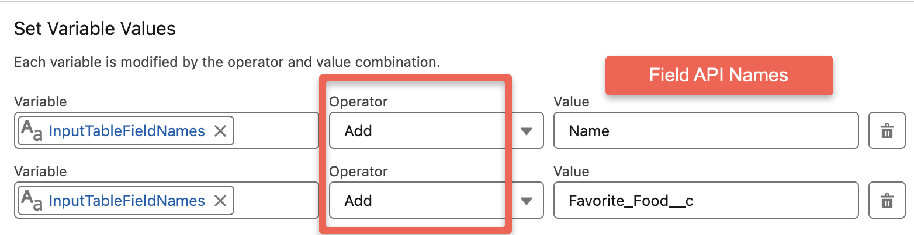
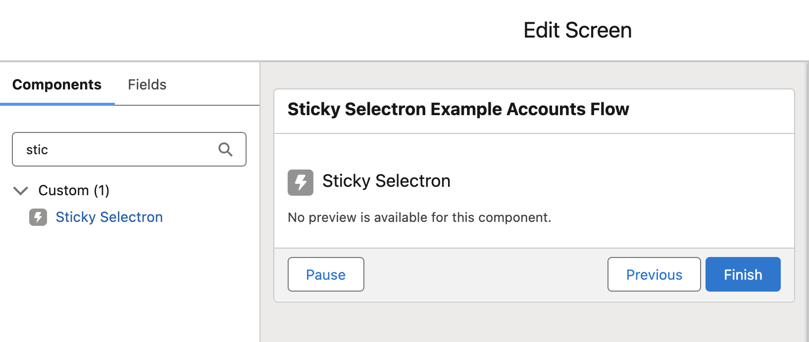
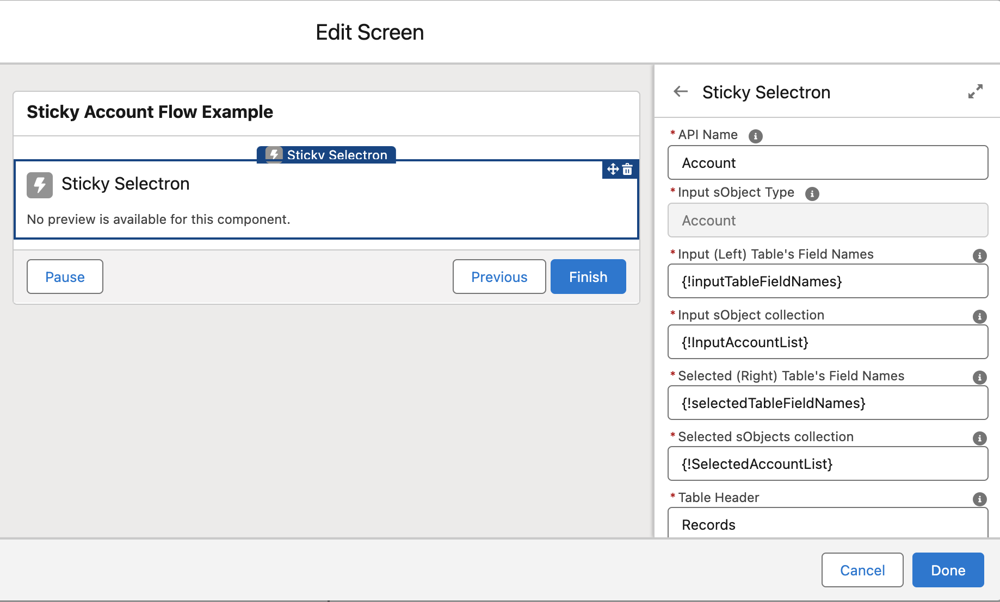
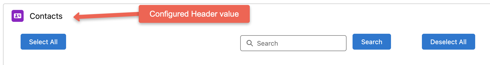

# Configuring Sticky Selectron

## Data Sources
Sticky Selectron supports selecting records from a single object, standard or custom. The selection the object is defined during configuration.

## Sample Flow
Sticky Selectron comes with a Sample flow called Sticky Selectron Example Account Flow. This flow is deactivated and intended to demonstrate how to use Sticky Selectron. The example flow is optional when using MetaDEPLOY to install Sticky Selectron, it is a good example and can be deleted later
from Flows. See the [Example Flows](https://sfdo-community-sprints.github.io/SSSFDG/docs/example-flows/) page for more information. This sample flow is referenced as example information in the configuration settings below.

## Known Field Display Limitations
Join us in making Sticky Selectron even better! These are the currently identified limitations for field display (and are part of our planned feature list). 

- Date, Date/Time and Time field types display are displayed as system values.
- Relationship fields display the ID of the related record. You can, however, display a formula field that references a related object.
- Field Labels are displayed as column headers.
- Checkboxes display as True and False (not as a checkbox graphic).
- Number display will drop decimals in display if they are 00, or will drop the last decimal in display if it ends in a 0.
-  Percent displays as a decimal value (no percentage symbol).
-  Currency does not display with a currency symbol. Decimal display behaves the same as number display. Multi-currency has not yet been tested.
-  Hyperlink function in text formula fields displays the raw HTML generated by the hyperlink function.

## Configure Resources
The flow will need to reference a set of variables (Collection Variables, Record collection Variables and Variables) that you will need to build for the Sticky Selectron to reference them in configuration. 
We recommend that you create these resources before configuring Sticky Selectron. 

Below is a list of the resources you will need to create and how they are used/populated. The sample collection names are from the sample flow (Sticky Selectron Example Account Flow) provided in the package, in other words, you can use your own variable names, they do not have to match the example names.

You will be creating the following new resources in your flow:

- 2: Collection Variables of Data Type TEXT, which allow multiple values and are available for input.
- 2: Collection Variables of Data Type RECORD, which allow multiple values and are available for
input and output.
- 2: Variables of Data Type NUMBER; these are not collections, do not allow multiple values and
have zero decimal places and a default value of zero.

| Description | Type | Assignment/Use | Sample Name from flow |
| --- | --- | --- | --- |
| **Collection Variable:** Used to configure which columns should display on the left _selectable_ side of the Sticky Selectron Table. | Resource Type: Variable, Data Type: Text, Allow Multiple values (collection): True, Available for input: True | Populated with an assignment element in the flow. See [Assign Column Display Collection Variables](#assign-column-display-collection-variables). | inputTableFieldNames |
| **Collection Variable:** Used to configure which columns should display on the right _selected_ side of the Sticky Selectron Table. | Resource Type: Variable, Data Type: Text, Allow Multiple values (collection): True, Available for input: True | Populated with an assignment element in the flow. See [Assign Column Display Collection Variables](#assign-column-display-collection-variables) . | selectedTableFieldNames |
| **Record Collection Variable:** Record collection is used to store the records that should be displayed on the left _selectable_ side of the Sticky Selectron Table. | Resource Type: Variable, Data Type: Record Allow Multiple values (collection): True, Object: The object you are selecting from, Available for input: True, Available for output: True | Populated from within the flow with a *Get Records* Element or passed to the variable from another process. | inputAccountList |
| **Record Collection Variable:** Record collection is used to store the records that should be displayed on the right _seleced_ side of the Sticky Selectron Table. | Resource Type: Variable, Data Type: Record, Object: The object you select from, Allow Multiple values (collection): True, Available for input: True, Available for output: True | Populated by Sticky Selectron when users select records from within the screen flow. | selectedAccountList |
| **Variable:** Count of records in the SELECTABLE Record Collection Variable. | Resource Type: Variable, Data Type: Number, Allow Multiple values (collection): False, Decimal Places: 0, Default Value: leave blank or set to 0 | Populated by Sticky Selectron. You can reference this variable elsewhere in your flow. | listCount |
| **Variable:** Count of records in the SELECTED Record Collection Variable. | Resource Type: Variable, Data Type: Number, Allow Multiple values (collection): False, Decimal Places: 0, Default Value: leave blank or set to 0 | Populated by Sticky Selectron. You can reference this variable elsewhere in your flow.  | selectedListCount |

## Assign Column Display Collection Variables

Using an Assignment Element - Assign the columns you wish to display to the two collection variables you created to store the information. In the Sticky Selectron Example Account Flow, this is
demonstrated with two assignment elements. Still, it is possible to assign both collection variables to the
same assignment element. Please note that you use the 'Add' Operator and you will type in the API name of the
fields you want to display for the Object Sticky Selectron. The column will display the fields Label.

## Adding and Configuring Sticky Selectron
Sticky Selectron is available from a Screen Element in Edit mode. Select Sticky Selectron from the Components tab and drag it onto the screen. Once Sticky Selectron is on the screen elemenent, click on it to configure it. Please follow the next section (Configuration Options) for information configuring each setting. 

## Configuration Options
Below is a list of the settings that need to be configured.

| Setting Name |Description | Sample Value |
| --- | --- | --- |
| **API Name** | Whatever API Name you want to give the component | Display_Sticky_Selectron_Accounts |
| **Input sObject Type** | This is the Object used by Sticky Selectron, once you select an object and save this field will not be editable   | Account |
| **Input (Left) Table's Field Names** | This is the Collection Variable that is used to configure which columns should display on the left _selectable_ side  | inputTableFieldNames |
| **Input sObject collection**| This is the Record Collection Variable created to store the records that will be selectable | inputAccountList |
| **Selected (Right) Table's Field Names** | This is the Collection Variable that is used to configure which columns should display on the right _selected_ side | selectedTableFieldNames |
| **Selected sObjects collection** | This is the Record Collection Variable created to store the records that have been selected | selectedAccountList |
| **Table Header** | This is the header you want to display above the record selection UI. See screenshot before the Advanced Settings Section. | Accounts |
| **Output the count of inputSObjectsList records** | This is the Variable created that stores the count of records in the SELECTABLE Record Collection Variable | listCount |
| **Output the count of selectedSObjectsList records** | This is the Variable created that stores the count of records in the SELECTED Record Collection Variable | selectedListCount |

**Advanced Settings**
Under Advanced Settings select the checkbox called **Manually assign variables**. There are three output configuration fields that need to be configured in Advanced Settings. Populate these with the same values used in the Standard settings.

| Setting Name |Description | Sample Value |
| --- | --- | --- |
| **Input sObject collection** | This is the Record Collection Variable created to store the records that will be selectable | inputAccountList |
| **Output the count of selectedSObjectsList records** | This is the Variable created that stores the count of records in the SELECTED Record Collection Variable | selectedListCount |
| **Selected sObjects collection** | This is the Record Collection Variable created to store the records that have been selected | selectedAccountList |

Next review the [Example Flows](https://sfdo-community-sprints.github.io/SSSFDG/docs/example-flows/) page to see a simple example of how to build the flow.
