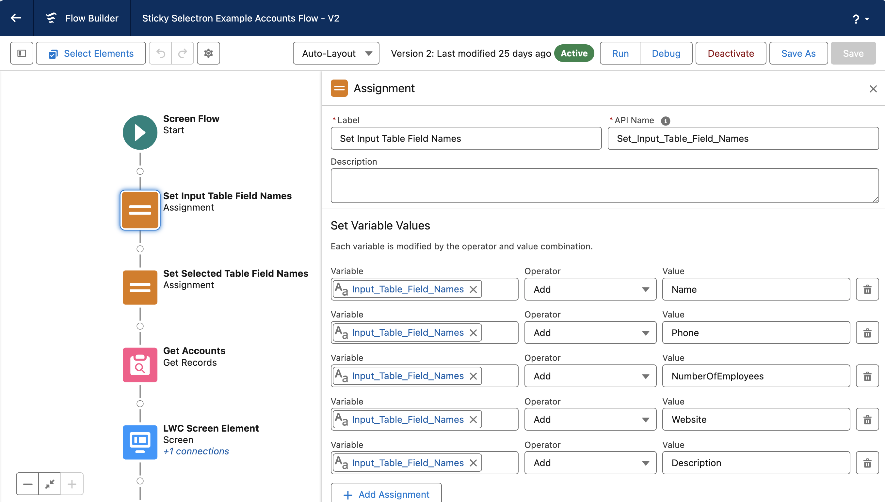

# Example Flows

Here are some examples of how you might use the Sticky Selectron component from within a screen flow.

## Sticky Selectron Example Account Flow

When installing Sticky Selectron through MetaDEPLOY, you can optionally install this sample flow.
This flow is deactivated and intended to demonstrate how to use Sticky Selectron. 

Below is a breakdown explaining the flow.

**Overview**

**Resources & Elements**

The resources are described in the [configuration](/sticky-selectron-documentation/docs/configuration/) document. 

**Explanation**

1. Assign the left (Unselected) columns. Up to five columns. If using a custom field use the field's API name (with __c at the end).

2. Assign the right (Selected). Up to two Columns.
3. The Get Records element is where the collection of unselected records is populated. This collection doesn't have to be populated directly from a Get elements as demonstrated, but it does have to be populated. It could, for example, also be populated with an assignment element. In this case the configuration for How to Store Record Data is 'Choose fields and assign variables (advanced), and the input_Account_List was populated in the Record Collection Field.
_If Choosing Fields, the Column header fields MUST be selected in order to display those columns in Sticky Selectron._

4. This is a screen component using Sticky Selectron. When clicking on Sticky Selectron you can see the configuration settings. Be sure to check the advanced settings as well as three fields need to be populated. 

