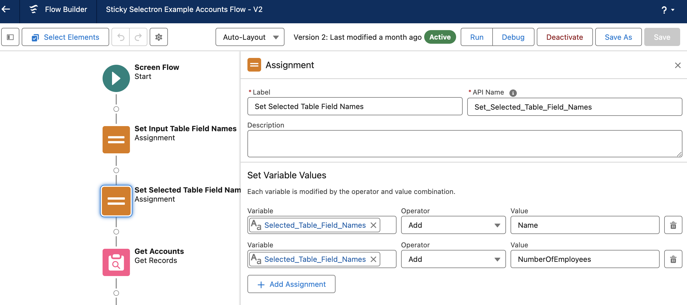

# Example Flows

Here are some examples of how you might use the Sticky Selectron component from within a screen flow.

## Sticky Selectron Example Account Flow

When installing Sticky Selectron through MetaDEPLOY, you can optionally install this sample flow.
This flow is deactivated and intended to demonstrate how to use Sticky Selectron. 

Below is a breakdown explaining the flow.

**Overview**

**Resources & Elements**

The resources are described in the [configuration](/sticky-selectron-documentation/docs/configuration/) document. 

**Explanation**

1. Assign the left (Unselected) columns by adding the field API name to the Input_Table_Field_Names variable. This variable stores the column field names and defineds which columns will be displayed. Assign up to five columns. If using a custom field use the field's API name (with __c at the end). Sticky Selectron left-to-right column display corresponds to top to bottom field assignment. 

2. Assign the right (Selected) columns by adding the field API name to the Selected_Table_Field_Names variable. This variable stores the column field names and defineds which columns will be displayed. Assign up to two columns. If using a custom field use the field's API name (with __c at the end). Sticky Selectron left-to-right column display corresponds to top to bottom field assignment.

3. The Get Records element retrieves Account records and assigns them to the input_Account_List record variable. This is the collection of unselected records. Assignment to the variable is achieved in the section 'How to Store Record Data' set to: 'Choose fields and assign variables (advanced)', and the input_Account_List is populated in the Record Collection Field. This configuration also requires the selection of which fields to store. 
- _The column header fields MUST be selected and available in order to display those columns and related data in Sticky Selectron._
- 
4. This is a screen component using Sticky Selectron. When clicking on Sticky Selectron you can see the configuration settings. Be sure to check the advanced settings as well as three fields need to be populated. 
- 
- 
- 

